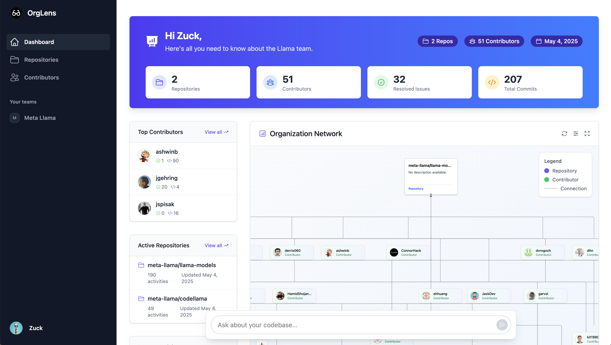

# OrgLens Llama Hackathon Project


*OrgLens: Understanding your codebase and connecting with experts, powered by Llama.*

Built for the Llamacon Hackathon ([05/04/2025]).

## The Problem

Finding the right expert or understanding code history in large organizations is time-consuming and inefficient. Key knowledge often stays siloed or buried in commit logs.

## Our Solution: OrgLens

OrgLens connects to your GitHub organization, analyzes repositories, commits, and contributors, and uses **Llama** to generate insightful summaries. It helps you:

*   Instantly find contributors with specific expertise.
*   Understand individual contributions through AI-generated profiles.
*   Query your codebase's history and activity using natural language.
*   Interact with contributor "digital twins" (AI based on their work) for context before direct contact.

## Core Features

*   AI-Powered Contributor Summaries & Profiles.
*   Natural Language Codebase Querying.
*   Repository & Contributor Exploration.
*   "Digital Twin" Interaction via Chat.

## Tech Stack

*   **Backend:** Python (Django), Llama API
*   **Frontend:** ReactJS, Vite, Tailwind CSS
*   **APIs:** GitHub API

## Getting Started

1.  **Clone the repository:**
    ```bash
    git clone [https://github.com/TheCl3m/llama-hack]
    cd orglens
    ```
2.  **Set up Backend (Django):**
    ```bash
    cd backend
    python -m venv venv
    source venv/bin/activate  # Use `.\venv\Scripts\activate` on Windows
    pip install -r requirements.txt
    # Create a .env file in this 'backend' directory
    # Add your API keys and Django secret key:
    # LLAMA_API_KEY=your_llama_api_key
    # Add any other necessary backend env vars (like DB config if not SQLite)
    python manage.py migrate # Run migrations if needed
    python manage.py runserver
    ```
    *The backend should now be running, typically on `http://127.0.0.1:8000/`.*

3.  **Set up Frontend:**
    *(In a separate terminal)*
    ```bash
    cd frontend
    npm install
    npm run dev
    ```
    *The frontend development server should now be running, typically on `http://localhost:5173/` (check terminal output).*

4.  **Access the App:** Open your browser to the frontend URL (e.g., `http://localhost:5173`).

## Team

*   OrgLens
*   Clement (TheCl3m) - [GitHub](https://github.com/TheCl3m)
*   Karol (KaroL) - [GitHub](https://github.com/MrCogito)

## Acknowledgements

*   Powered by **Meta Llama**.
*   Thanks to Cerebral Valley and Meta for the opportunity to build this project.
